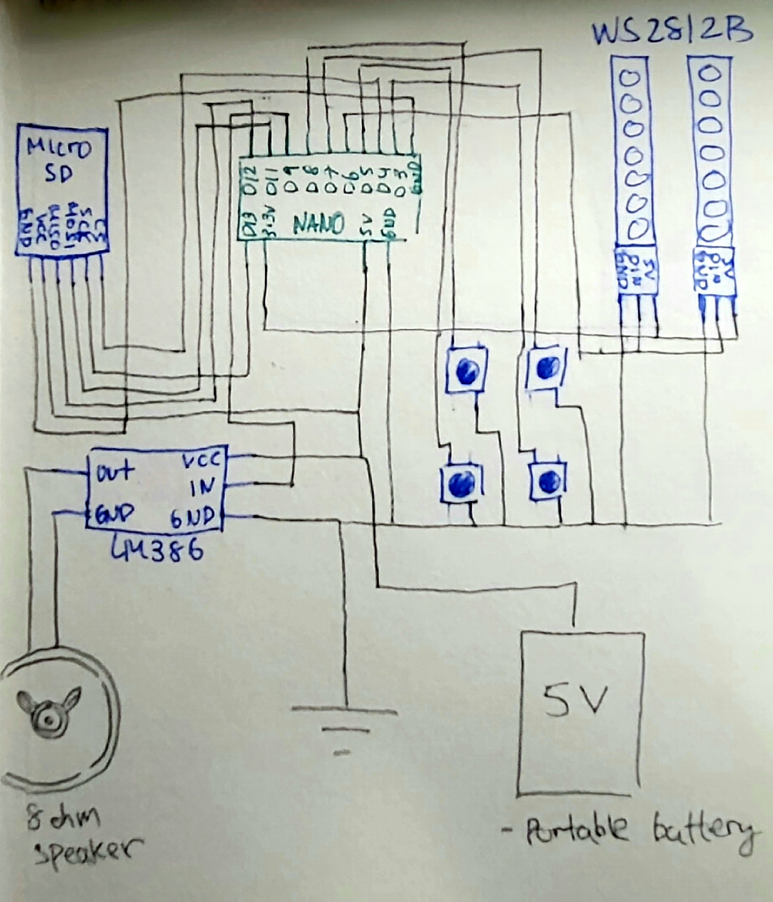

# Tinkering with Arduino
## Overview
With my repository filled with programming projects, I thought to include another hobby of mine with electronics. First introducing the well known open source electronic hardware and software platform [Arduino](https://www.arduino.cc/). Specifically, I was looking into the [Arduino Nano Version 3](https://docs.arduino.cc/hardware/nano?queryID=undefined) which is a part of a family of small and compact Arduino boards. The software used to program the Arduino is a variant of C++ with the necessary hardware implementations.

This project was used for a cosplay convention but can also be reused for other purposes.

## Hardware Resources
* [Arduino Nano V3](https://docs.arduino.cc/hardware/nano?queryID=undefined)
* [MicroSD card module](https://www.amazon.ca/MicroSD-Adapter-Arduino-Loggers-Raspberry/dp/B081QNLP7H/ref=sr_1_20?keywords=arduino+sd+card+module&qid=1696049335&sr=8-20)
* [LM386 module](https://www.amazon.ca/LM386-Amplifier-Module-5V-12V-Adjustable/dp/B0BKZ8P6NH/ref=sr_1_5?crid=3JREZVKGU71HC&keywords=lm386&qid=1696049381&sprefix=lm386%2Caps%2C88&sr=8-5)
* [Two 1 meter WS2812 RGB LED strips (NeoPixel)](https://www.adafruit.com/product/2541)
* [8 ohm 1 watt speaker](https://www.adafruit.com/product/1313)
* [Four Tactile push buttons](https://www.adafruit.com/product/1119)

### Extra Resources
* [Two Red LEDs](https://www.adafruit.com/product/777)
* [8xAA battery holder](https://www.adafruit.com/product/875)
* [Four silicone neon LEDs](https://www.adafruit.com/product/3860)
* [3xAAA battery holder with on/off switch](https://www.adafruit.com/product/727)

The goal was to have a an audio file stored in the MicroSD module to play a sound on the speaker from pressing the push buttons that is programmed with the Arduino Nano, which will also activate different colours of the LED strips based on which button was pressed.

The last four components from the list above are for soley for lighting effects. Sketches will be included [here if interested](https://github.com/BnZel/Tinkering_with_Arduino/blob/main/images)

## Schematic
My hand drawn schematic may not be the best, schematic design software will be considered for future projects of this type.

## Software Resources 
* [SD](https://www.arduino.cc/reference/en/libraries/sd/)
* [TMRpcm](https://www.arduino.cc/reference/en/libraries/tmrpcm/)
* [SPI](https://www.arduino.cc/reference/en/language/functions/communication/spi/)
* [ezButton](https://www.arduino.cc/reference/en/libraries/ezbutton/)
* [FastLED](https://fastled.io/)

Usage of the libraries are self explanatory as most of the code is based on defining where the the components are hooked up to the Nano to initialize.
[To see the entirety of the code](https://github.com/BnZel/Tinkering_with_Arduino/blob/main/cosplay_project.ino).
